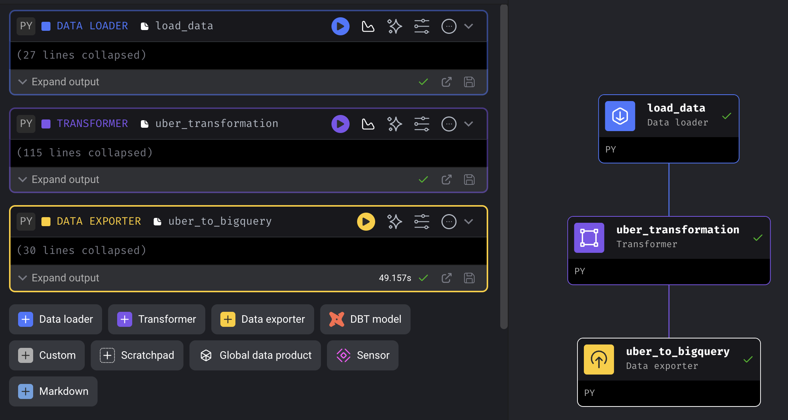

The data resource is https://www.nyc.gov/site/tlc/about/tlc-trip-record-data.page
The data dictionary is in the folder. You can check it.

It's a Uber dataset. I download the data and stored it in the GCP bucket. The public url as follows.
https://storage.googleapis.com/uber-data-engineering-project-lyj/uber_data.csv

The picture of data pipeline tree as follows.

After load the data to bigquery. Do some data analysis. 
Tables have been manipulated using SQL languge. As follow.
https://console.cloud.google.com/bigquery?sq=949636664416:6e74c2ed85414168af37cce403ca6c8b

Finally, performed data analyse visualization using Looker Studio.
https://lookerstudio.google.com/reporting/2330c0aa-197f-4309-9cf9-4614b785d529

